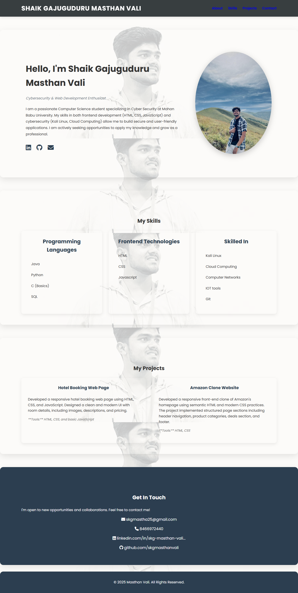

# Shaik Gajuguduru Masthan Vali - Portfolio

This is a personal portfolio website showcasing my skills, projects, and professional experience.

## Live Demo

You can view a live version of the portfolio here:

[**Live Portfolio**](https://my-portfolio-xb1h.vercel.app/)

(Note: Replace the link above with the actual URL after you have published your site, for example, on GitHub Pages.)

## Screenshot

Here is a full screenshot of the portfolio website:

## About Me

I am a passionate Computer Science student specializing in Cyber Security. My portfolio highlights my skills in both frontend development and cybersecurity, demonstrating my ability to build secure and user-friendly applications.

## Technologies Used

- **Frontend:** HTML, CSS, JavaScript
- **Icons:** Font Awesome

## Key Features

- **Responsive Design:** The website is designed to look great on both desktop and mobile devices.
- **Projects Section:** Details on my projects, including:
    - A responsive Hotel Booking Web Page.
    - A front-end clone of Amazon's homepage.
- **Skills Showcase:** A clear breakdown of my programming languages and technical skills.

## Getting Started

To view the website, simply clone this repository and open the `index.html` file in your web browser.

## Contact

- **Email:** skgmastha25@gmail.com
- **LinkedIn:** [https://www.linkedin.com/in/skg-masthan-vali-602600312](https://www.linkedin.com/in/skg-masthan-vali-602600312)
- **GitHub:** [https://github.com/skgmasthanvali](https://github.com/skgmasthanvali)